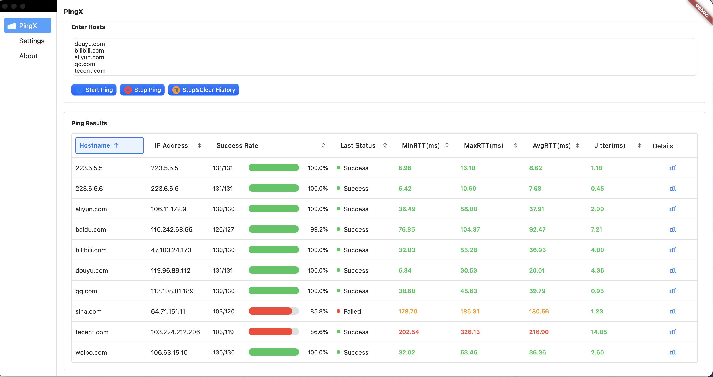
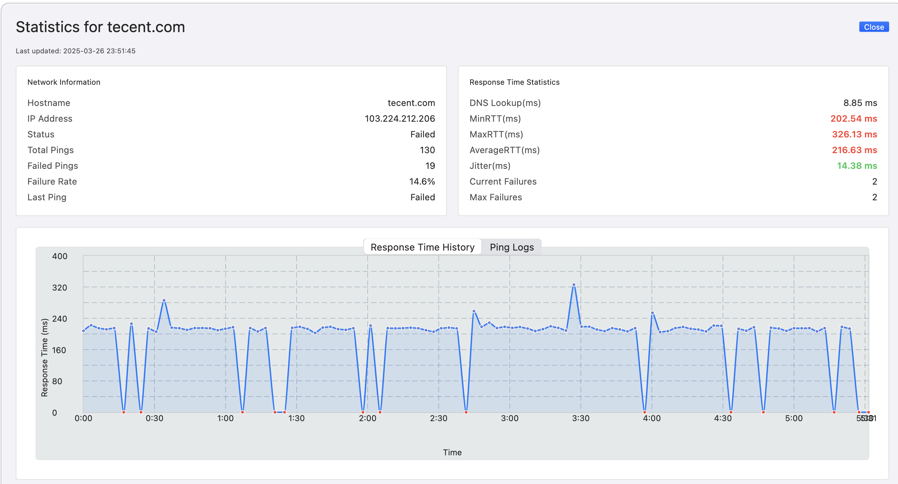

# PingX Flutter

A modern, cross-platform network ping utility built with Flutter and Dart.

## Screenshot





## Features

- **Multi-Host Pinging**: Ping multiple hosts simultaneously
- **Flexible Input Support**:
  - IPv4 addresses (e.g., `192.168.1.1`)
  - IPv6 addresses (e.g., `2001:db8::1`)
  - Domain names (e.g., `google.com`)
  - CIDR ranges (e.g., `192.168.1.0/24`)
- **Real-time Statistics**:
  - Success/failure rates
  - Min/Max/Avg latency
  - Standard deviation
  - Packet loss tracking
  - DNS lookup time measurement
  - Consecutive failure tracking
  - Maximum failure streak tracking
  - Jitter calculation
- **Advanced Visualization**:
  - Real-time response time charts
  - Color-coded status indicators
  - Sortable results table
  - Detailed ping logs
- **CIDR Range Options**:
  - Skip first address in range
  - Skip last address in range
- **Configurable Settings**:
  - Ping interval (default: 3 seconds)
  - Timeout duration
  - TTL value
  - Packet size
  - Maximum concurrent probes
  - History size

## Requirements

- Flutter SDK
- Dart SDK
- macOS (for development)

## Getting Started

1. Clone the repository:
   ```bash
   git clone <repository-url>
   cd pingx_flutter
   ```

2. Install dependencies:
   ```bash
   flutter pub get
   ```

3. Run the app:
   ```bash
   flutter run
   ```

## Usage

1. Launch the application
2. Click "Add Hosts" to open the input dialog
3. Enter hosts (one per line) in any of these formats:
   - IPv4: `8.8.8.8`
   - IPv6: `2001:db8::1`
   - FQDN: `google.com`
   - CIDR: `192.168.1.0/24`
4. Click "Start Pinging" to begin
5. View real-time results in the main window
6. Click on any host row to view detailed statistics and charts

## Configuration

The following settings can be adjusted:

- `count`: Number of pings per host (default: 4)
- `timeout`: Ping timeout in seconds (default: 2)
- `size`: Packet size in bytes (default: 56)
- `wait`: Interval between pings in seconds (default: 3)
- `maxStoreLogs`: Maximum number of ping logs to store (default: 100)
- `maxConcurrentProbes`: Maximum number of concurrent ping operations (default: 100)
- `skipCidrFirstAddr`: Skip first address in CIDR ranges (default: false)
- `skipCidrLastAddr`: Skip last address in CIDR ranges (default: false)

## Dependencies

- `dart_ping`: For ICMP ping operations
- `flutter_riverpod`: State management
- `macos_ui`: Native macOS UI components
- `fl_chart`: Interactive charts and graphs

```bash
flutter config --enable-macos-desktop

flutter run -d macos

flutter build macos --release

mkdir -p tmp_dmg && cp -r "build/macos/Build/Products/Release/PingX.app" tmp_dmg/ && create-dmg \
  --volname "PingX" \
  --window-pos 200 120 \
  --window-size 800 400 \
  --icon-size 100 \
  --icon "PingX.app" 200 190 \
  --hide-extension "PingX.app" \
  --app-drop-link 600 185 \
  "PingX.dmg" \
  "tmp_dmg/"

rm -rf tmp_dmg
```

## License

This project is under Apache License 2.0